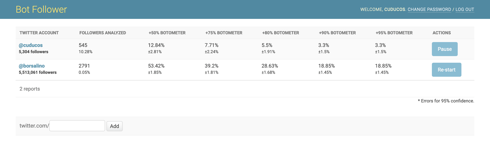

# Bot Followers []() []() []()

A web app to check whether followers of a given Twitter account are bots using [Botometer](https://botometer.iuni.iu.edu/). This repository started as a _fork_ of [Twitter
Clean-up](https://github.com/cuducos/twitter-cleanup).



If you're looking for the CLI version, [it's tagged](https://github.com/cuducos/bot-followers/tree/cli).

## Installing

1. Make sure you meet these requirements:
  1. [Twitter API keys](https://developer.twitter.com/apps)
  1. [Botometer API key](https://market.mashape.com/OSoMe/botometer)
  1. **For development**, [Docker Compose](https://docs.docker.com/compose/)
  1. **For production**, [Dokku](http://dokku.viewdocs.io/dokku/)
1. Run `python env.py` to create a `.env` file with the required environment variables. Feel free to explore the options available with the `--help` argument.

### Development environment

To start the services use the default `docker-compose up`. To prevent errors in the development environment, make sure the you have `DEBUG=True` in your `.env` file.

### Deploy environment

Having a Dokku-ready server:

1. Install the following Dokku plug-ins:
  1. [PostgreSQL](https://github.com/dokku/dokku-postgres-plugin) (or other database of your choice)
  1. [RabbitMQ](https://github.com/dokku/dokku-rabbitmq-plugin) (or other Celery broker of your choice)
  1. [Let's Encrypt](https://github.com/dokku/dokku-letsencrypt)
1. Create an app for _Bot Followers_ in Dokku, add it as a remote repository in your local Git repository, and activate the plug-ins.
1. For each variable in `.env`, create an equivalent environment variable for your Dokku app.

## Usage

The commands in this section might be prefixed by:

* `docker-compose run --rm django` in **development** mode
* `dokku run <app name>` in **production** mode

### Dashboard

In order to get the app ready, before visiting `/` at your server, you need to run migrations and create a user(s) to access the dashboard.


1. Run migrations with `python manage.py migrate`
1. Create a _super_ user for yourself with `python manage.py createsuperuser`

**It's recommended** to create a proper user to access the dashboard without _super_ powers: all you need to do is to:

1. Login in as _superuser_ create a new user that is _staff_
2. Get back to the _edit_ page of this user
3. In the _Permissions_ menu, add **only** the permission to _view report_ to this new user

### API

There is a simple JSON API at `/api/` to share the report data without the need of user or login.

### Management commands

#### Importing data from the [CLI version](https://github.com/cuducos/bot-followers/tree/cli)

```bash
$ python manage.py import /path/to/borsalino.sqlite3
```

#### Check whether active/inactive jobs are in sync in the dashboard

```bash
$ python manage.py updatecelerytasks
```

#### Empty the queue of pending tasks

```bash
$ python manage.py purgecelerytasks
```

## Contributing

Please, write tests, run checks, and format your code with [Black](https://github.com/ambv/black):

```bash
$ python manage.py test
$ mypy env.py
$ black .
```
